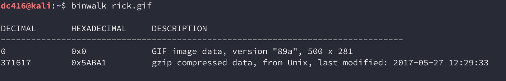
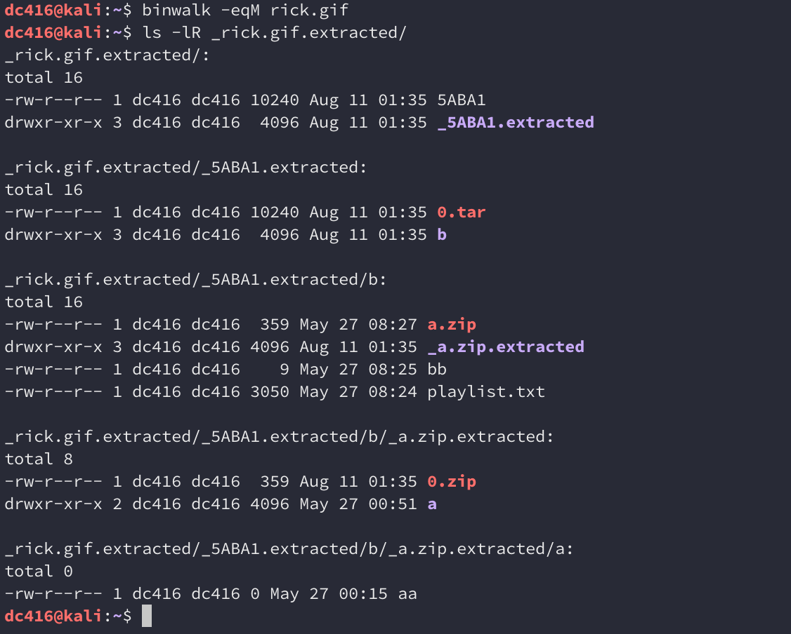
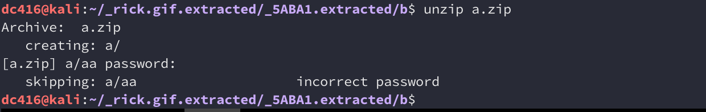
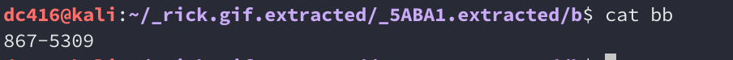
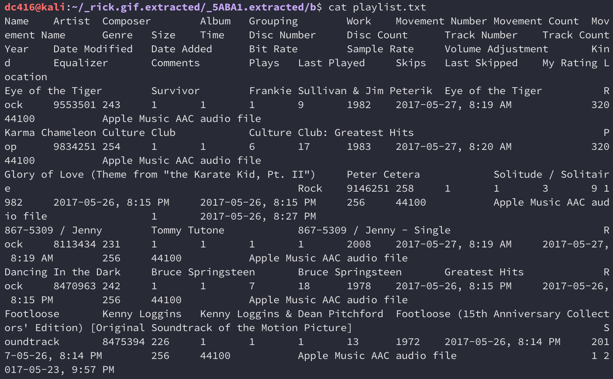
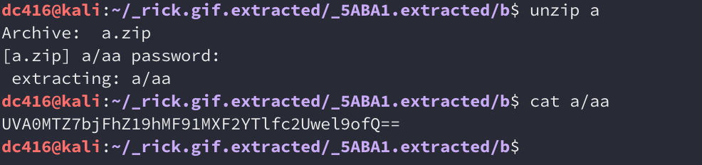
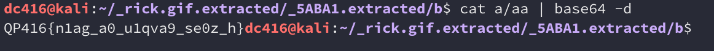
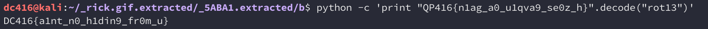

## DC416 Rapid-fire CTF: Forensics

> Throwback to the 80's! Where's the flag?
> 
> Good luck!

We're given a GIF file called `rick.gif`. Here's what it looks like:

Presumably there's some hidden data in this file. We can examine it using `binwalk`

Looks like there's a hidden compressed archive in there. `binwalk` can be used to extract its contents: 

From the directory tree, we can tell that an archive called `b` was extracted and found to contain three files: `a.zip`, `bb`, and `playlist`. Let's take a look at each one. 

The contents of `a.zip` were extracted into `_a.zip.extracted/a`, but notice that there's nothing there. Sometimes this means `binwalk` was unable to unzip the archive properly, so let's try to do it manually. 

That's the problem, it's prompting for a password. Without the correct one, `binwalk` was unable to properly get the contents of the archive. We can try guessing the password, but let's look at the other files first, starting with `bb`.

It appears to be a number. Trying this as the password on `a.zip` doesn't work. Let's take a look at `playlist.txt`

It's a playlist of songs from the 80's. If we look at this carefully, we see that the same number in `bb`is in the playlist as **867-5309 / Jenny**. Jenny is in fact, the password to `a.zip`. We can extract the contents of `a.zip` and read `aa`:

If you've been around the block a few times, you'll recognize this string as Base-64 encoded. Decoding it reveals another string that appears to be the flag, but not quite:

The flag is actually encoded using a substition cipher, in this case ROT-13. Decoding it reveals the flag:

