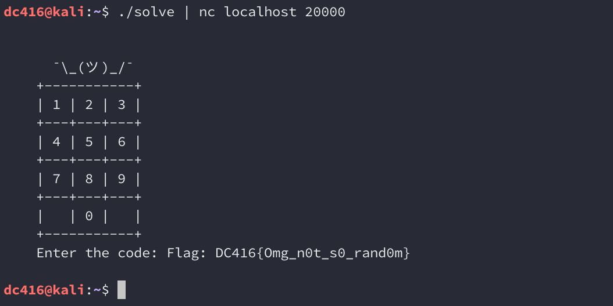

## DC416 Rapid-fire CTF: PWN-2

> The challenge to exploit is listening on localhost port 20000
> 
> Can you guess the correct code to get the flag?
> 
> Additional tools that might come in handy:
> 
> * pwntools
> * gdb-peda
> 
> Good luck!

Let's go ahead and connect to port 20000 and see what's going on. 


The service only waits a couple of seconds before terminating the connection making guessing the code difficult. The source code is provided, so let's take a look at what's going on:

```
/*
 * DC416 Rapid Fire CTF Pwnable
 * by superkojiman
 */

#include <stdio.h>
#include <stdlib.h>
#include <string.h>
#include <time.h>
#include <unistd.h>
#include <signal.h>

char *keypad = "\n\n" \
    "      ¯\\_(ツ)_/¯\n" \
    "    +-----------+\n" \
    "    | 1 | 2 | 3 |\n" \
    "    +---+---+---+\n" \
    "    | 4 | 5 | 6 |\n" \
    "    +---+---+---+\n" \
    "    | 7 | 8 | 9 |\n" \
    "    +---+---+---+\n" \
    "    |   | 0 |   |\n" \
    "    +-----------+\n" \
    "    Enter the code: ";

void win() {
    FILE *f;
    char buf[30];
    f = fopen("/home/randomcode/flag.txt", "r");
    memset(buf, 0, sizeof(buf));
    fgets(buf, sizeof(buf), f);
    printf("Flag: %s\n", buf);
}

void byebye() {
    puts("Too slow!"); 
    exit(0);
}

int main(int argc, char *argv[]) {
    long code; 
    long guess; 

    setbuf(stdout, 0); 
    setbuf(stderr, 0); 

    signal(SIGALRM, byebye);
    alarm(2);

    while (1) {
        char buf[10];
        memset(buf, 0, sizeof(buf));
        srand(time(0)); 
        code = rand() % 90000000 + 10000000; 

        printf("%s", keypad); 
        read(0, buf, sizeof(buf)); 
        guess = atol(buf); 

        if (code == guess) {
            win();
            break; 
        }
    }

    return 0; 
}
```

Let's focus on what `main()` is doing. This first part sets up an alarm that calls the `byebye()` function after 2 seconds. This is what's responsible for terminating the connection. 

```
    signal(SIGALRM, byebye);
    alarm(2);
```

Next we have a loop that seeds the current time and generates a random number from 90000000 to 99999999. 

```
    while (1) {
        char buf[10];
        memset(buf, 0, sizeof(buf));
        srand(time(0)); 
        code = rand() % 90000000 + 10000000; 
```

The program then waits for input and checks to see if it's identical to the random number. If it is, `win()` is called and the flag is printed out:

```
        printf("%s", keypad); 
        read(0, buf, sizeof(buf)); 
        guess = atol(buf); 

        if (code == guess) {
            win();
            break; 
        }
    }
```

So where's the bug? It's hard to predict the pseudorandom values returned by `rand()` unless we can determine what the seed to `srand()` was. But because `srand(time(0))` is called at every iteration of the loop, we can create our own program that calls `srand(time(0))` followed by `rand()`, and thereby get the same value the program is expecting.

Here's some code that does just that:

```
#include <stdio.h>
#include <stdlib.h>
#include <time.h>
#include <unistd.h>

int main(int argc, char *argv[]) {
    long code1;

    while (1) {
        srand(time(0));
        code1 = rand() % 90000000 + 10000000;
        printf("%ld\n", code1);
    }

    return 0;
}
```

When we run this, it will return the code that the service is expecting. 


Great, now we just need to send this code over to the service to get the flag. Easily done with `nc`: 



