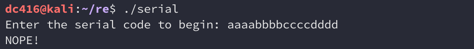
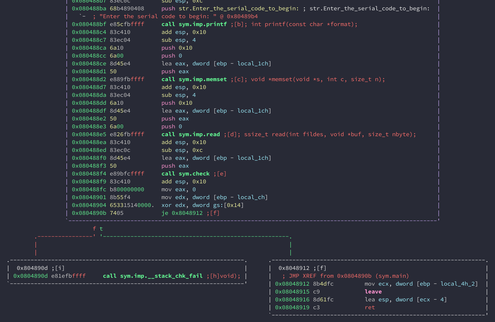
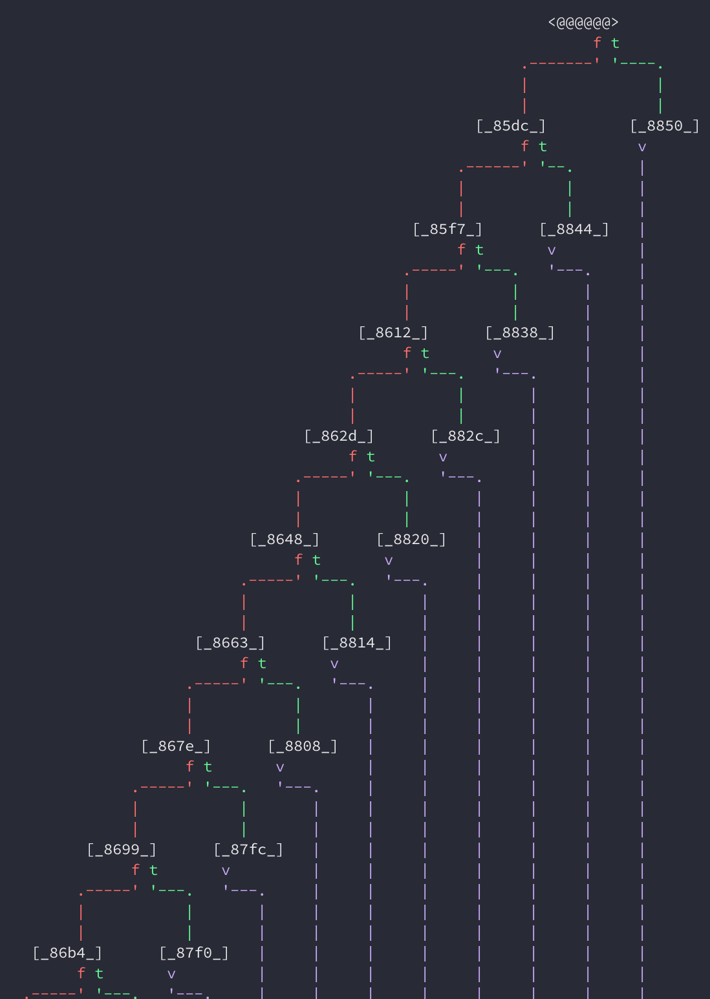
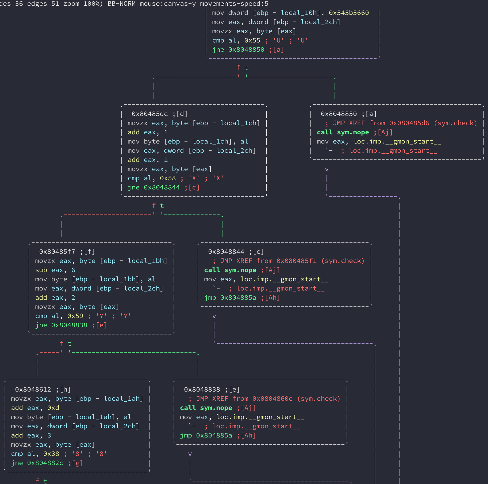
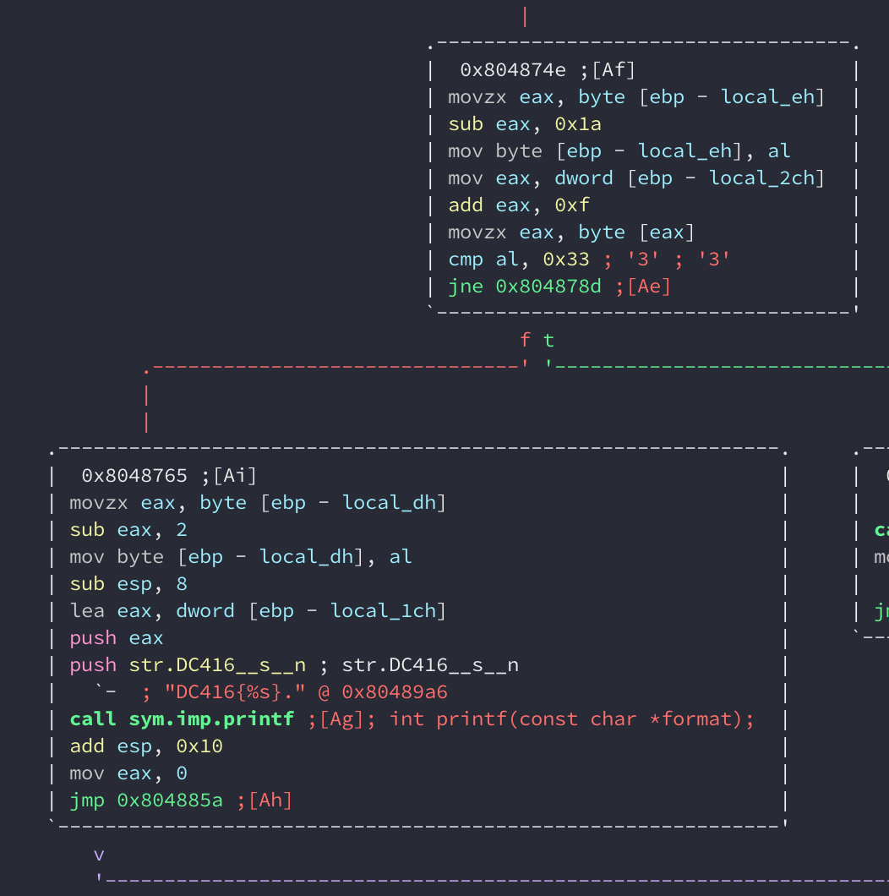
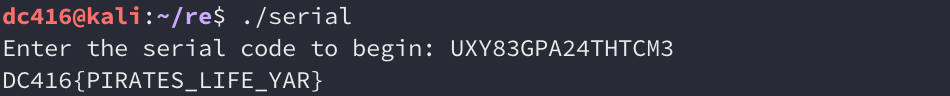

## DC416 Rapid-fire CTF: Reverse Engineering

> Figure out the serial code to get the program to print the flag.
> 
> Additional tools that might come in handy:
> 
> * Binary Ninja Demo
> * IDA Pro Evaluation
> 
> Good luck!

Let's run the binary and see what happens:

Pretty simple. We just need to provide the correct code and it should print the flag. Being a reverse engineering challenge, there is no source code provided, so we'll need to examine the binary in a disassembler. 

Binary Ninja Demo, IDA Pro Evaluation, and radare2 are installed in the VM. There are several ways to tackle this challenge, but interestingly, radare2 wins at solving this. 

So let's load the binary into radare2 and have a look at the `main()` function. Here's the part that prompts us to enter the serial code. 

At `0x080488f4`, it calls the `check()`. So presumably `check()` will determine if the code we entered is correct. Let's examine `check()`. If we look at the mini-graph view in `check()`, this is what we see:

This staircase graph usually indicates deeply nested `if` statements. Let's view the blocks in detail:

Sure enough, the disassasembly corresponds to `if` statements. In this case, it compares each byte in our input with a character. If they're equal, it moves on to the next character. Otherwise, it calls `nope()` and exits. The cool thing here is that radare2 actually tells you what the ASCII equivalent of the expected hex value is. For instance 0x55 is 'U', 0x58 is 'X', 0x59 is 'Y', and so on. 

Right at the end of the function, we see that it prints out the flag if all the characters in our input are correct:

So radare2 basically gives us the code in plain sight. We can just scroll down the graph, record the the ASCII value of each expected byte, and pass it to the `serial` challenge to get the flag:

